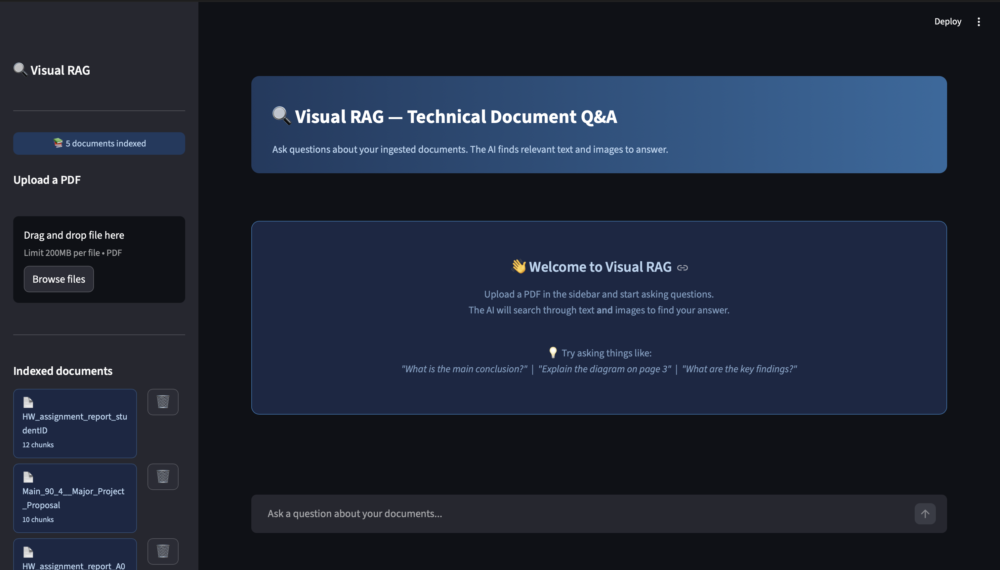

# 🔍 Visual RAG — Technical Document Q&A

An AI-powered system that lets you ask questions about technical documents — including charts, diagrams, and images — using Retrieval-Augmented Generation (RAG) with vision capabilities.

## 📌 What it does

Most AI systems only read text. This system can **see and reason** through technical documents by:

- Extracting text from PDFs and splitting into searchable chunks
- Detecting images and diagrams and auto-captioning them using GPT-4o Vision
- Storing everything in a vector database (ChromaDB) using semantic embeddings
- Answering natural language questions by retrieving the most relevant text **and** images
- Citing the exact page and document each answer came from
- Showing confidence scores for each retrieved source
- Supporting per-document and cross-document search

## 🖥️ Demo



## 🏗️ Architecture
PDF Input
├── Text Extraction (PyMuPDF)
│     └── Chunked → Embedded → ChromaDB (per-document collection)
└── Image Extraction (PyMuPDF)
└── GPT-4o Vision Caption → Embedded → ChromaDB
User Question
└── Embedded → Similarity Search (ChromaDB)
└── Top-k chunks + images → GPT-4o → Answer + Citations + Confidence

## 🛠️ Tech Stack

| Component | Technology |
|---|---|
| PDF parsing | PyMuPDF |
| Image captioning | GPT-4o Vision |
| Embeddings | OpenAI text-embedding-3-small |
| Vector database | ChromaDB |
| LLM | GPT-4o |
| UI | Streamlit |


## 🚀 Getting Started

### 1. Clone the repository
```bash
git clone https://github.com/Devam15/visual-rag.git
cd visual-rag
```

### 2. Set up environment
```bash
python3 -m venv venv
source venv/bin/activate
pip install openai chromadb pymupdf streamlit python-dotenv
```

### 3. Add your OpenAI API key
```bash
cp .env.example .env
# Edit .env and add your key
```

### 4. Run the app
```bash
streamlit run app.py
```

### 5. Ingest a document via terminal (optional)
```bash
python ingest.py your_document.pdf
```

## 💡 Use Cases

- Query technical manuals and datasheets by diagram content
- Search through engineering reports with charts and figures
- Ask questions across multiple documents simultaneously
- Build a personal knowledge base from research papers

## 🔑 Design Decisions

**Per-document collections** — each PDF gets its own ChromaDB collection for precise targeted search, avoiding irrelevant chunks from other documents bleeding into answers.

**Master collection** — a separate `all_documents` collection is maintained in parallel for cross-document search.

**Confidence scoring** — cosine distances from ChromaDB are converted to percentages and colour-coded (green/yellow/red) so users can see how confident the retrieval was.

**Scanned PDF handling** — if PyMuPDF extracts no content, the system detects this and returns a clean error rather than crashing.

## 📁 Project Structure

```
visual-rag/
├── app.py          # Streamlit web UI
├── ingest.py       # PDF ingestion pipeline
├── query.py        # Command line query interface
├── .env.example    # Environment variable template
└── chroma_db/      # Vector database (auto-generated, gitignored)
```